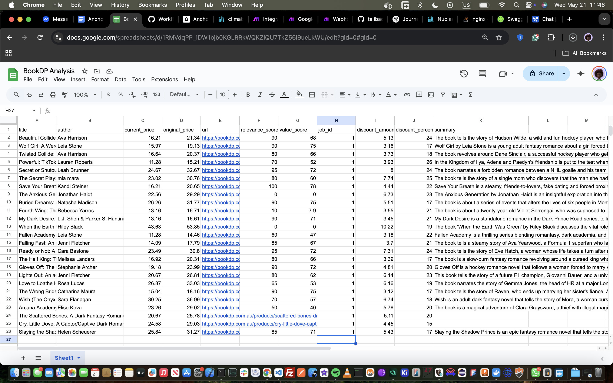
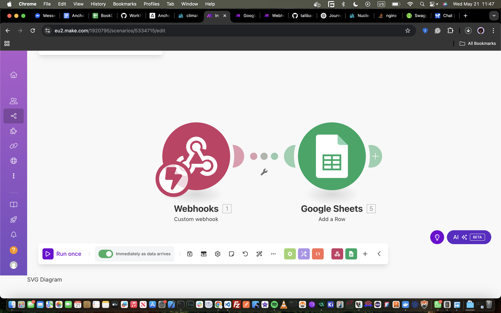
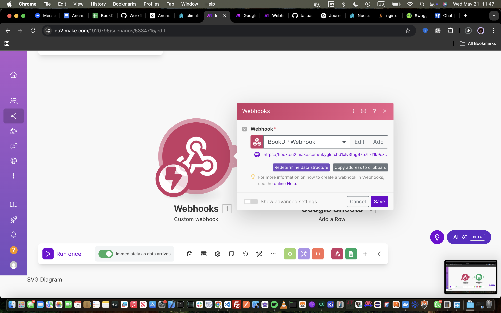
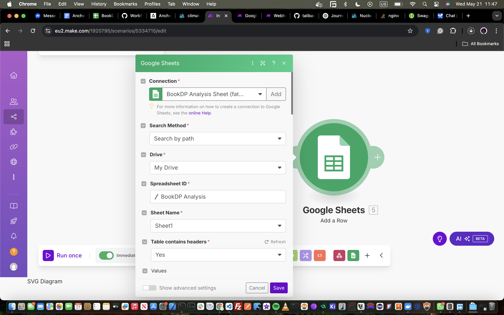
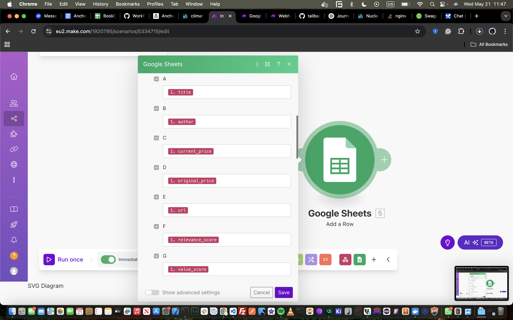
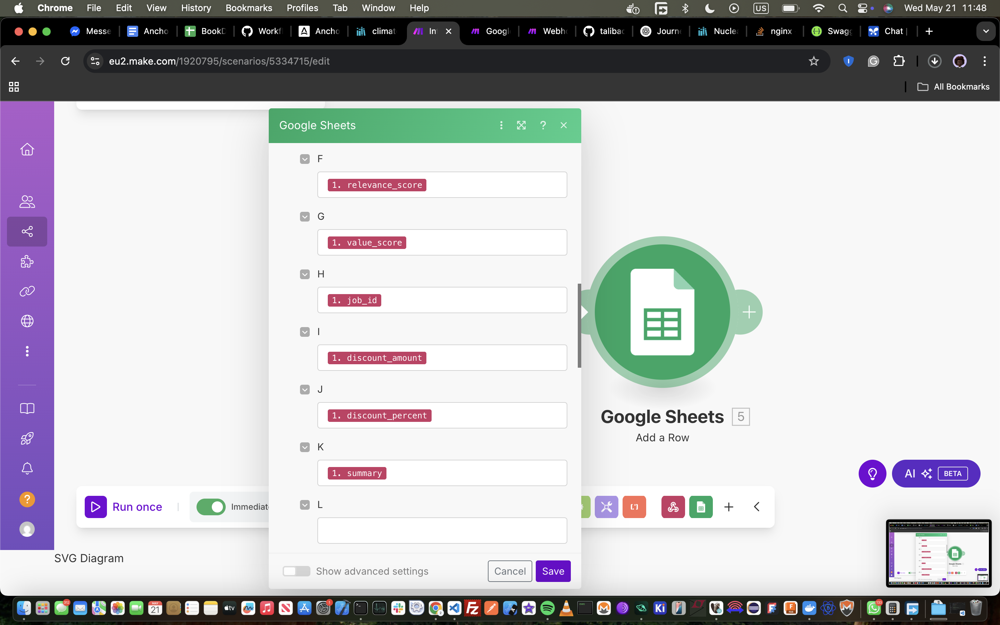
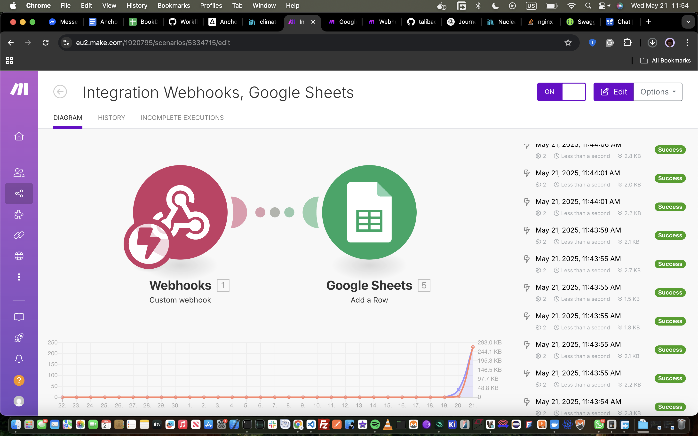

# 📚 BookDp Automated Analysis ✨

[](https://www.typescriptlang.org/)
[](https://nodejs.org/)
[](https://pptr.dev/)
[](https://www.make.com/)

Automated agent to scrape book data from BookDP.com.au, enrich it with AI insights, calculate costs, and dispatch it to your favorite productivity tools via Make.com!

## 🚀 Project Overview

This project is a TypeScript-based automation agent designed to:

-  **Scrape Book Data:** Utilizes Puppeteer & Browser Pool to dynamically browse BookDP.com.au based on a user-provided thematic keyword (e.g., "australian history," "sci-fi novels").
-  **AI Enrichment:** Leverages an AI model (e.g., OpenAI's GPT) to add value to the scraped data. This could include generating summaries, getting relevance score.
-  **Cost Calculation:** Processes pricing information, value score, discounts.
-  **Productivity Integration:** Sends the structured, enriched data to a Make.com webhook, enabling seamless integration with tools like Google Sheets, Trello, Slack, Notion, etc.

The core goal is to demonstrate robust web automation, AI integration, efficient data processing, and third-party workflow automation.

## ✨ Features

*   **Keyword-based Scraping:** Dynamically fetches books related to any theme.
*   **Robust Web Automation:** Powered by Puppeteer with browser-pool for concurrent, load-balanced browser instance management and scraping.
*   **Concurrent Processing:** Designed to scrape and process multiple book entries concurrently for significant speed improvements.
*   **AI-Powered Insights:** Enriches raw data with intelligent summaries, classifications, or other AI-generated content.
*   **Flexible Cost Analysis:** Basic cost extraction and calculation logic.
*   **Seamless Make.com Integration:** Easily pipe data into your existing workflows.
*   **Typed & Modular:** Built with TypeScript for better maintainability and type safety.

## 🛠️ Tech Stack

*   **Language:** TypeScript
*   **Runtime:** Node.js
*   **Web Scraping:** Browser Pool & Puppeteer
*   **AI Integration:** OpenAI API
*   **Workflow Automation:** Make.com
*   **Messaging:** Apache Kafka

## ⚙️ Prerequisites

*   Docker for contenarization.
*   A Make.com account and a configured scenario with a Webhook trigger.
*   OpenAI API Key

## 💻 Instructions for Running Locally

1.  **Clone the Repository:**
    ```bash
    git clone https://github.com/talibackend/anchor-browser-test.git
    cd anchor-browser-test
    ```

2.  **Set Up Environment Variables:**
    ```bash
    cp .env.example .env
    ```
    #### **Replace placeholders with your actual credentials and URLs.**
    #### **You don't have to update the `DB_CONNECTION_STRING`, docker compose will help spin up the postgres DB**


3.  **Build & Start the Project with Docker**
    ```bash
    docker build -t anchor_browser_test:latest .
    docker-compose up -d
    ```
    #### **✅ The swagger docs should be available on http://localhost:9898/doc**
    #### **The directory is binded to the docker container, so subsequent updates to the codebase will update the container automatically.**

## 🏗️ Architecture and Approach

 The agent is designed as a web service with asynchronous background processing.

-  **API Layer (e.g., using Express.js):**
    *   Handles incoming HTTP requests.
    *   Performs rate limiting on requests.
    *   Responsible for validating input (e.g., presence of 'theme' in `/scrape` payload).
    *   Manages API endpoints:
        *   `POST /scrape`: Initiates a new job.
        *   `GET /status/:id`: Checks job progress.
        *   `GET /results/:id`: Retrieves job output.

-  **Job Management System:**
    *   When a `/scrape` request is received:
        *   A unique `id` is generated.
        *   The job (theme, status: 'running') is stored in a postgres database.
        *   A background worker is being initialized for the job.
        *   A response containing the id of the job is returned.

-  **Background Worker Process:**
    *   **Scraping:**
        *   Uses browser-pool to efficiently manage multiple Puppeteer browser instances.
        *   Navigates to the search output page of BookDP.com.au, this helps to skip entering the input. i.e:
        ```javascript
        let url = `https://bookdp.com.au/?s=${replaceAll(job.theme.toLowerCase(), " ", "+")}&post_type=product`;
        ```
        *   Extracts book data.
        *   Publish each book analysis to the `scrape_book_jobs` topic.
        
- **Kafka Worker:**
    * Listens to the Kafka topic `scrape_book_jobs`.

    * For each message:

        * Scrapes relevant book data using Puppeteer from the browser-pool.

        * Enriches the data with AI (summary, classification, etc.).

        * Calculates derived metrics like discount scores.

        * Sends the final structured result to a Make.com webhook.

        *   Google sheet is [https://docs.google.com/spreadsheets/d/1RMVdqPP_iDW1bjb0KGLRRkWQKZiQU7TkZ56i9ueLkWU/edit?usp=sharing](https://docs.google.com/spreadsheets/d/1RMVdqPP_iDW1bjb0KGLRRkWQKZiQU7TkZ56i9ueLkWU/edit?usp=sharing)

        * Store and update relevant data using a transaction.

        This simplified, single-worker design ensures all processing happens asynchronously and in one place, making deployment and debugging easier while still enabling concurrency and resilience via Kafka.


## ⏱️ Concurrency & Performance

### ⏳ Time Complexity: `O(1)`
The system leverages Kafka's pub/sub model where each message is processed independently. Each message's processing happens in constant time (O(1)) with respect to its own size.
With a retry policy of 3, the worst-case processing for a failed message is up to 3 retries. However, since retries are still constant time per attempt, the amortized time complexity remains O(1).

### 🧠 Space Complexity: `O(n)`
Here, n is the number of in-flight messages being concurrently processed.
Even with retries, once a message is committed, it's no longer retained in memory.
Because retries are published as new messages and old ones are fully committed, there's no cumulative memory buildup, and the space complexity remains O(n).

## 🔗 Make.com Integration Setup

1.  **Log in to your Make.com account.**
2.  **Create a New Scenario.**
3.  **Add a Webhook Trigger:**
    *   Search for the "Webhooks" app and select it.
    *   Choose the "Custom webhook" trigger.
    *   Click "Add", give your webhook a name (e.g., "Book Scraper Hook"), and click "Save".
    *   Make will generate a unique URL. **Copy this URL** and paste it into your `.env` file as `MAKE_WEBHOOK_URL`.
    *   Make will now be "listening" for data. You might need to run your script once to send sample data so Make can determine the data structure.

4.  **Add Subsequent Modules:**
    *   Click the "+" to add another module after the webhook.
    *   Choose the app you want to send data to (e.g., Google Sheets, Trello, Slack, Airtable).
    *   Configure the module. For example:
        *   **Google Sheets "Add a Row":** Select your spreadsheet and sheet. Map the fields from the webhook data (e.g., `1.title`, `1.author`, `1.ai_summary`) to the columns in your sheet.

5.  **Data Structure:**
    The webhook will receive a JSON payload. Below is a sample:
    ```json
    {
        "title" : "string",
        "author" : "string",
        "current_price" : "number",
        "original_price" : "number",
        "url" : "string",
        "relevance_score" : "number",
        "value_score" : "number",
        "job_id" : "number",
        "discount_amount" : "number",
        "discount_percent" : "number",
        "summary" : "string"
    }
    ```

6.  **Activate Your Scenario:**
    *   Once configured, turn your scenario "ON" (usually a toggle switch at the bottom).
    *   Ensure "Run immediately" is enabled if you want it to process data as soon as it arrives.

7. **Screenshots**
    * Below are some screenshots related to the make scenerio and the google sheet  
  








## 📝 Assumptions & Limitations

*   **Website Structure Dependent:** The scraper's reliability heavily depends on the HTML structure of BookDP.com.au. Changes to the website may break the scraper, requiring updates to selectors.
*   **Rate Limiting & IP Bans:** Aggressive scraping can lead to IP blocks or CAPTCHAs.
*   **AI Model Costs & Limits:** AI API calls incur costs and are subject to rate limits by the provider.
*   **AI Accuracy:** The quality of AI enrichment depends on the model used and the clarity of prompts. AI may occasionally produce inaccurate or nonsensical results.
*   **Make.com Plan Limitations:** Your Make.com plan might have limits on the number of operations or data transfer.
*   **Error Handling:** While basic error handling is included, complex scenarios (e.g., network timeouts during AI calls, specific website errors) might require more sophisticated retry mechanisms.

## 💡 Future Improvements

*   Implement proxy rotation and user-agent switching.
*   More sophisticated error handling and retry logic.
*   GUI or web interface for easier use.


---